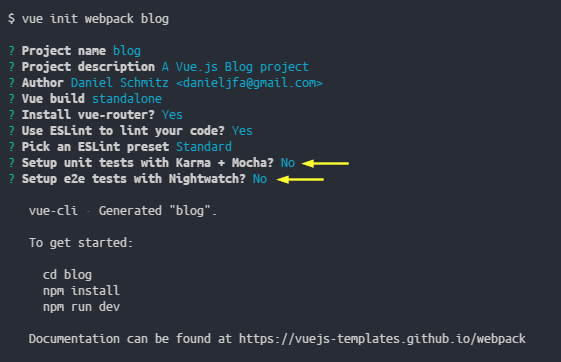

# Vue.js 2 + Firebase
Nova app do livro "Vue.js na prática"

## Instalação Inicial

Adicionar o `vue-cli`

```console
npm i -g vue-cli
```

Criar o projeto

```console
 vue init webpack blog
```



```console
cd blog
npm install
npm run dev
```

Adicionar bibliotecas Vue

```console
npm i -S vuex vue-resource bulma
```

Adicionar o arquivo css do Bulma no projeto

```javascript
// src/main.js
import Vue from 'vue'
import App from './App'
import router from './router'
require('../node_modules/bulma/css/bulma.css')

... continua ...
```

Otimizar o router, para que o import seja carregado sozinho

```js
// src/router/index.js
import Vue from 'vue'
import Router from 'vue-router'

Vue.use(Router)

function load (component) {
  return () => System.import(`../components/${component}.vue`)
}

export default new Router({
  routes: [
    {path: '/', name: 'Hello', component: load('Hello')},
    { path: '*', component: load('Error404') }
  ]
})
```
Criar o componente `Error404`

```html
<!-- src/components/Error404.vue -->
<template>
  <div>
    <h1>Not Found</h1>
  </div>
</template>

<script>
export default {

}
</script>
```

